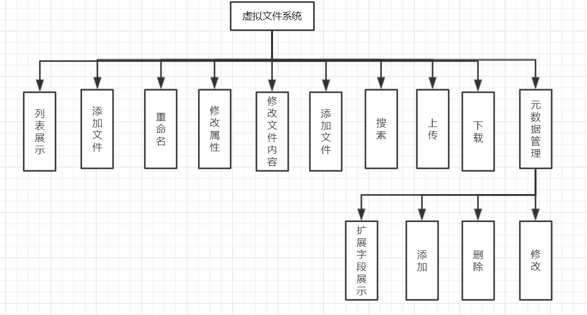
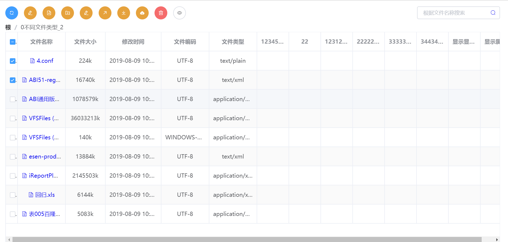
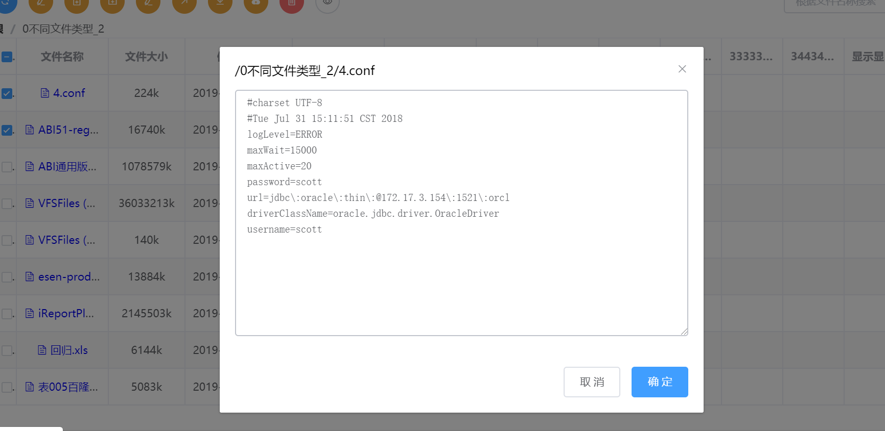
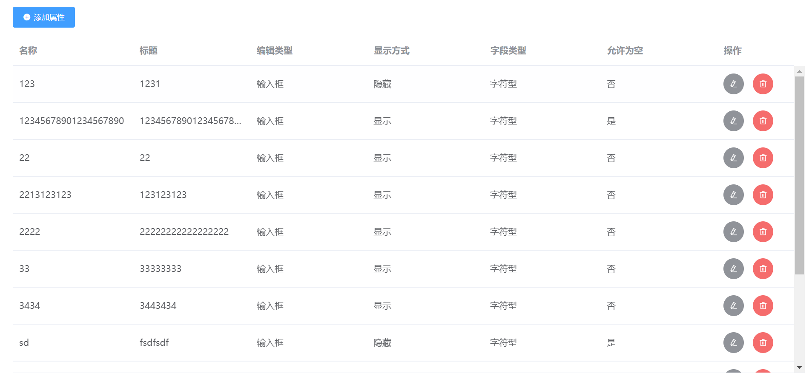
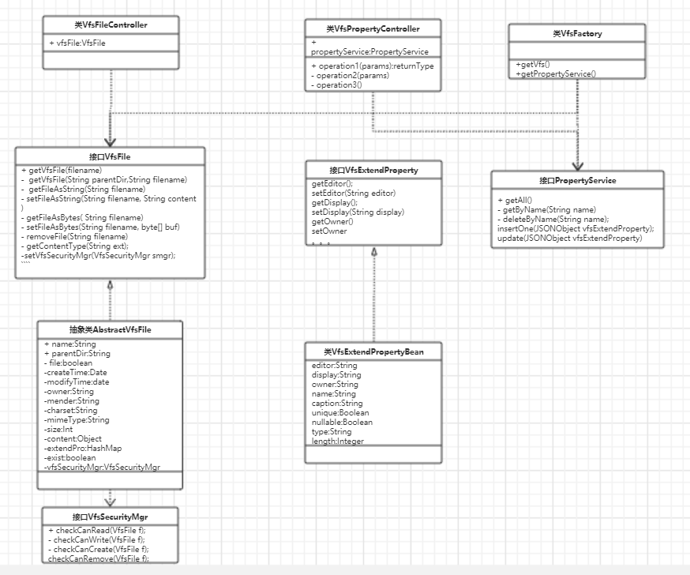

# 虚拟文件系统（VFS）

## 背景

​	税务管理系统的需要用到esenface的资源管理器这个功能，但考虑到一下几点esenface中vfs类太多太杂，而且技术栈不同，所以需要重新开发此功能。

## 功能描述

​	此虚拟文件系统是属于企业税务管理平台的一个功能模块，也可以独立运行或集成到其他系统中。

​    虚拟文件系统（vfs）是为了屏蔽不同存储实现而设计的，通过定义一组文件操作接口，完成对文件的读、写、内容修改。通常我们的信息会保存在磁盘或数据库中，通过实现磁盘虚拟文件系统和数据库虚拟文件系统，在磁盘和数据库虚拟文件系统中对文件或目录执行读写、移动、复制、删除等操作，就与我们在操作系统上执行一样方便。

## 概要设计

### 功能设计

### 数据字典

#### 文件表数据字典

| 字段名     | 数据类型 | 默认值 | 允许非空 | 自动递增 | 备注           |
| ---------- | -------- | ------ | -------- | -------- | -------------- |
| name       | varchar  |        | false    | false    | 文件名         |
| size       | int      |        | false    | false    | 文件大小       |
| updateDate | datetime |        | false    | false    | 更新时间       |
| charset    | varchar  | utf-8  | false    | false    | 字符集         |
| type       | varchar  |        | false    | false    | 文件类型       |
| file       | boolean  | true   | false    | false    | 是否是文件     |
| parentDir  | varchar  |        | false    | false    | 上级目录的路径 |
| ext        |          |        |          |          | 扩展属性       |

#### 元数据表数据字典

| 字段名   | 数据类型 | 默认值      | 允许非空 | 自动递增 | 备注                               |
| -------- | -------- | ----------- | -------- | -------- | ---------------------------------- |
| name     | varchar  |             | false    |          | 属性名                             |
| caption  | varchar  |             | false    |          | 标题                               |
| length   | int      |             | true     |          | 长度                               |
| editor   | varchar  | input       | false    |          | 输入类型（输入框，下拉框等）       |
| nullable | boolean  | true        | false    |          | 能否为空                           |
| display  | varchar  | show        | false    |          | 显示方式（在文件列表中隐藏或显示） |
| type     | varchar  | C（字符串） | false    |          | 数据类型（字符串，数字等）         |
| unique   | boolean  | false       | false    |          | 是否唯一                           |

## 详细设计

### 页面设计

#### 文件页面

如上图页面分为上中下三部分，上面部分为操作按钮以及搜索框，中间为当前展示列表的上级目录路径，下面部分是文件列表，展示了文件的属性值，以及扩展属性值。

上图展示了，文件的内容，点击文件名称便可弹出此弹窗，可以再次弹框中修改文件内容。

#### 元数据管理页面

### 类设计

### 技术架构
    此系统前端采用vue+elementUI，后端使用springboot。
### 底层数据库实现方案
    因为此vfs工程只写了页面，定义的接口以及一些通用的方法实现，所以具体的数据存储要看实现这想要用什么方式（mysql，oracle，本地文件或其他nosql数据库等）。下面是实现方案：
    1. maven引入vfs工程
    2. 继承AbstractVfsFile，并注入到spring
    3. 实现PropertyService接口，并注入到spring
    